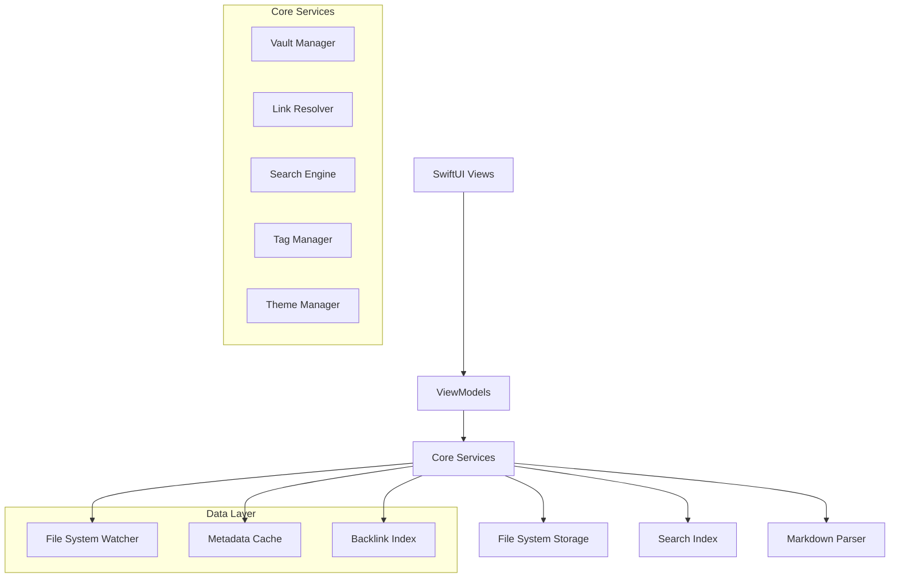

# Design Document

## Overview

The Obsidian-inspired markdown editor will be built as a native SwiftUI application for macOS, with potential for cross-platform expansion using SwiftUI's multi-platform capabilities. The architecture emphasizes local-first data storage, real-time markdown processing, and a modular design that supports extensibility through a plugin system.

The application follows a Model-View-ViewModel (MVVM) architecture pattern, leveraging SwiftUI's reactive programming model and Combine framework for data flow management. All user data remains local, stored as plain markdown files with a lightweight metadata layer for indexing and search optimization.

## Architecture

### High-Level Architecture



### Technology Stack

- **UI Framework**: SwiftUI with AppKit integration for advanced file operations
- **Markdown Processing**: Swift-based CommonMark parser with GFM extensions
- **File System**: Foundation FileManager with FSEvents for real-time monitoring
- **Search**: Core Spotlight integration with custom full-text indexing
- **LaTeX Rendering**: MathJax integration through WKWebView
- **Persistence**: Plain markdown files with JSON metadata cache
- **Reactive Programming**: Combine framework for data binding and event handling

## Components and Interfaces

### 1. Vault Management System

**VaultManager**
- Manages multiple vault instances and their lifecycle
- Handles vault opening, closing, and switching operations
- Maintains vault-specific configurations and preferences

```swift
protocol VaultManagerProtocol {
    func openVault(at url: URL) async throws -> Vault
    func closeVault(_ vault: Vault)
    func getCurrentVault() -> Vault?
    func getRecentVaults() -> [VaultReference]
}
```

**Vault**
- Represents a single knowledge base with its file structure
- Provides file enumeration and hierarchy management
- Maintains vault-specific metadata and settings

### 2. Note Management System

**NoteManager**
- Handles CRUD operations for individual notes
- Manages note metadata and frontmatter parsing
- Coordinates with file system watcher for real-time updates

**Note Model**
- Represents individual markdown files with parsed content
- Includes frontmatter metadata, body content, and computed properties
- Maintains modification timestamps and file system references

```swift
struct Note: Identifiable, Codable {
    let id: UUID
    let filePath: String
    let title: String
    let frontmatter: [String: Any]
    let content: String
    let modifiedDate: Date
    let tags: Set<String>
}
```

### 3. Linking and Backlink System

**LinkResolver**
- Parses wikilinks and resolves them to actual notes
- Maintains bidirectional link relationships
- Handles link updates when notes are renamed or moved

**BacklinkManager**
- Builds and maintains backlink index for all notes
- Identifies unlinked mentions across the vault
- Provides real-time backlink updates as content changes

### 4. Search and Indexing System

**SearchEngine**
- Implements full-text search with fuzzy matching capabilities
- Supports advanced search operators and filtering
- Maintains inverted index for fast query processing

**IndexManager**
- Builds and maintains search indices for notes and metadata
- Handles incremental index updates for modified files
- Provides tag-based filtering and faceted search

### 5. Editor System

**MarkdownEditor**
- Custom SwiftUI text editor with markdown-aware features
- Implements syntax highlighting and live preview capabilities
- Handles wikilink detection and auto-completion

**PreviewRenderer**
- Converts markdown to attributed strings for display
- Handles LaTeX rendering through embedded web views
- Manages image and file embedding display

## Data Models

### Core Data Structures

```swift
// Vault representation
struct Vault {
    let id: UUID
    let name: String
    let rootURL: URL
    let settings: VaultSettings
    var notes: [Note]
    var folders: [Folder]
}

// Folder hierarchy
struct Folder {
    let id: UUID
    let name: String
    let path: String
    let parentID: UUID?
    var subfolders: [Folder]
    var notes: [Note]
}

// Link relationships
struct WikiLink {
    let sourceNoteID: UUID
    let targetNoteName: String
    let resolvedTargetID: UUID?
    let linkText: String
    let range: NSRange
}

// Search index entry
struct SearchIndexEntry {
    let noteID: UUID
    let content: String
    let tags: Set<String>
    let title: String
    let lastModified: Date
}
```

### Metadata Management

The application maintains a lightweight metadata cache stored as JSON files within a `.strontium` directory in each vault. This cache includes:

- Note index with file paths and modification dates
- Backlink relationships and unlinked mentions
- Tag index with usage counts
- Search index for fast querying
- User preferences and workspace configurations

## Error Handling

### File System Errors

- **File Not Found**: Graceful handling with user notification and link cleanup
- **Permission Denied**: Clear error messages with suggested solutions
- **Disk Full**: Automatic backup prevention and user warnings
- **Concurrent Modifications**: Conflict detection and resolution strategies

### Data Integrity

- **Corrupted Files**: Automatic backup restoration when possible
- **Invalid Markdown**: Graceful parsing with error highlighting
- **Broken Links**: Visual indicators and batch repair utilities
- **Index Corruption**: Automatic index rebuilding capabilities

### User Experience Errors

- **Search Timeouts**: Progressive search with partial results
- **Large File Handling**: Streaming and pagination for performance
- **Memory Pressure**: Intelligent caching and resource management

## Testing Strategy

### Unit Testing

- **Model Layer**: Comprehensive testing of data structures and business logic
- **Parser Components**: Markdown parsing accuracy and edge case handling
- **Search Engine**: Query processing and result ranking validation
- **Link Resolution**: Wikilink parsing and relationship management

### Integration Testing

- **File System Operations**: Vault management and file watching functionality
- **Search Integration**: End-to-end search workflow testing
- **UI Components**: SwiftUI view testing with mock data
- **Performance Testing**: Large vault handling and memory usage validation

### User Acceptance Testing

- **Workflow Testing**: Complete user scenarios from vault creation to note editing
- **Cross-Platform Compatibility**: Testing on different macOS versions
- **Accessibility Testing**: VoiceOver and keyboard navigation validation
- **Performance Benchmarking**: Response time measurements with various vault sizes

### Automated Testing Infrastructure

- **Continuous Integration**: GitHub Actions for automated test execution
- **Test Data Generation**: Synthetic vault creation for consistent testing
- **Performance Monitoring**: Automated performance regression detection
- **UI Testing**: Automated user interface interaction testing using XCTest